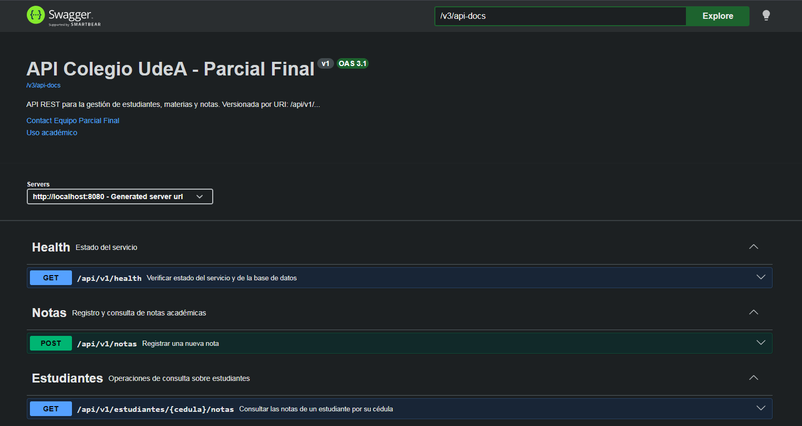

# Parcial Final — Arquitectura de Software (Backend)

API REST en **Spring Boot 3.5.14** para la gestión de **estudiantes, materias y notas** de un colegio, con persistencia en **PostgreSQL**, documentación con **Swagger / OpenAPI** y versionamiento de endpoints por URI (`/api/v1/...`).

> **Repositorio del frontend (React + TypeScript + Vite):** [https://github.com/Mista299/examen-arqui-frontend](https://github.com/Mista299/examen-arqui-frontend)

---

## Integrantes

| # | Nombre completo | Documento | Correo institucional |
| - | --- | --- | --- |
| 1 | Maria Fernanda Atencia | C.C. | [mariaf.atencia@udea.edu.co](mailto:mariaf.atencia@udea.edu.co) |
| 2 | Michael Stiven Tabares | C.C. | [michael.tabares@udea.edu.co](mailto:michael.tabares@udea.edu.co) |
| 3 | Isabela Bedoya | C.C. 1020106520 | [isabela.bedoya@udea.edu.co](mailto:isabela.bedoya@udea.edu.co) |

**Asignatura:** Arquitectura de Software — Semestre 7
**Programa:** Ingeniería de Sistemas — Universidad de Antioquia (UdeA)

---

## Stack y versiones

| Componente | Versión |
| --- | --- |
| Java (JDK) | 17 |
| Spring Boot | 3.5.14 |
| Maven | 3.9+ (incluye `mvnw`) |
| PostgreSQL | 13+ |
| Hibernate (vía Spring Data JPA) | incluido en Spring Boot 3.5.14 |
| springdoc-openapi (Swagger UI) | 2.8.16 |
| Lombok | incluido en Spring Boot 3.5.14 |

---

## Estructura del proyecto

```
.                                          # raíz del repositorio (ParcialFinal-Arquitectura)
├── docs/
│   └── swagger.png                       # Captura de Swagger UI
├── src/
│   ├── main/
│   │   ├── java/com/udea/parcialfinal/
│   │   │   ├── ParcialFinalApplication.java   # Punto de entrada de Spring Boot
│   │   │   ├── config/
│   │   │   │   └── OpenApiConfig.java         # Metadata de Swagger/OpenAPI
│   │   │   ├── controller/
│   │   │   │   ├── EstudianteController.java  # GET  /api/v1/estudiantes/{cedula}/notas
│   │   │   │   ├── NotaController.java        # POST /api/v1/notas
│   │   │   │   └── HealthController.java      # GET  /api/v1/health
│   │   │   ├── dto/
│   │   │   │   ├── EstudianteConNotasDTO.java # Salida del GET (datos del estudiante + notas)
│   │   │   │   ├── MateriaSimpleDTO.java      # Materia anidada en NotaResponseDTO
│   │   │   │   ├── NotaRequestDTO.java        # Body del POST
│   │   │   │   └── NotaResponseDTO.java       # Salida del POST
│   │   │   ├── exception/
│   │   │   │   ├── ErrorResponse.java              # DTO uniforme de error
│   │   │   │   ├── GlobalExceptionHandler.java     # @RestControllerAdvice
│   │   │   │   ├── RecursoNoEncontradoException.java # 404
│   │   │   │   └── ReglaNegocioException.java         # 400 por regla de negocio
│   │   │   ├── model/
│   │   │   │   ├── Estudiante.java              # @Entity tabla "estudiantes"
│   │   │   │   ├── Materia.java                 # @Entity tabla "materias"
│   │   │   │   └── Nota.java                    # @Entity tabla "notas"
│   │   │   ├── repository/
│   │   │   │   ├── EstudianteRepository.java
│   │   │   │   ├── MateriaRepository.java
│   │   │   │   └── NotaRepository.java
│   │   │   └── service/
│   │   │       ├── EstudianteService.java
│   │   │       └── NotaService.java
│   │   └── resources/
│   │       └── application.properties   # Configuración de datasource y JPA
│   └── test/
│       └── resources/
│           └── application.properties   # Configuración de H2 en memoria para tests
├── pom.xml
└── README.md
```

---

## Dependencias declaradas en `pom.xml`

| Dependencia | Scope | Propósito en el proyecto |
| --- | --- | --- |
| `spring-boot-starter-web` | compile | Servidor embebido Tomcat, `@RestController`, serialización JSON con Jackson |
| `spring-boot-starter-data-jpa` | compile | Mapeo ORM con Hibernate, `JpaRepository`, generación de tablas por `@Entity` |
| `spring-boot-starter-validation` | compile | Anotaciones `@NotBlank`, `@NotNull`, `@DecimalMin`, `@DecimalMax`, `@Valid` en DTOs y controllers |
| `spring-boot-starter-hateoas` | compile | Soporte para **HATEOAS** (hipermedia en las respuestas REST, p. ej. `EntityModel`, `Link`) |
| `springdoc-openapi-starter-webmvc-ui` (2.8.16) | compile | Swagger UI y OpenAPI JSON (usado en `OpenApiConfig` y anotaciones en controllers) |
| `org.postgresql:postgresql` | runtime | Driver JDBC de PostgreSQL (conexión a `colegioudea`) |
| `com.h2database:h2` | test | Base de datos en memoria para correr `mvn test` sin necesidad de PostgreSQL local |
| `org.projectlombok:lombok` | compile (annotation processor) | Genera getters/setters/builders; reduce boilerplate en DTOs, entities y services |
| `spring-boot-starter-test` | test | JUnit 5, Mockito, AssertJ, Spring Test (incluye el test `contextLoads()` por defecto) |

**Dependencias del BOM** (gestionadas transitivamente por `spring-boot-starter-parent`, no requieren declarar versión):

- `spring-core`, `spring-context`, `spring-beans`
- `hibernate-core`, `hibernate-validator`
- `jackson-databind`, `jackson-datatype-jsr310`
- `tomcat-embed-core`
- `slf4j-api`, `logback-classic`

---

## Cómo usar el proyecto

### 1. Clonar el repositorio

```bash
git clone https://github.com/Isa-Bedoya-UdeA/ParcialFinal-Arquitectura.git
cd ParcialFinal-Arquitectura
```

> Al clonar se crea la carpeta `ParcialFinal-Arquitectura/`. Los archivos del proyecto Spring Boot (`pom.xml`, `src/`, `docs/`, etc.) están en la **raíz** de esa carpeta, así que `mvn` se puede ejecutar directamente sin hacer más `cd`.

### 2. Verificar requisitos

- **JDK 17** instalado (`java -version` debe decir `17.x`)
- **Maven 3.9+** (`mvn -v`) o usar `./mvnw` / `mvnw.cmd` incluidos
- **PostgreSQL** corriendo localmente (puerto `5432` por defecto)
- **pgAdmin 4** para crear la base de datos visualmente

### 3. Crear la base de datos en pgAdmin

> **Importante:** no crear tablas ni schemas manualmente. Hibernate las genera al arrancar la app gracias a `spring.jpa.hibernate.ddl-auto=update`.

1. Abrir pgAdmin y conectar al servidor local (por defecto `localhost:5432`, usuario `postgres`).
2. Click derecho en **Databases** → **Create** → **Database…**
3. En la pestaña **General**:
   - **Database:** `colegioudea`
   - **Owner:** `postgres`
4. Click en **Save**. Solo eso. No tocar **Schemas** ni **Tables**.

### 4. Configurar credenciales

Editar `src/main/resources/application.properties` y reemplazar el password:

```properties
spring.datasource.url=jdbc:postgresql://localhost:5432/colegioudea
spring.datasource.username=postgres
spring.datasource.password=TU_PASSWORD_AQUI     # <-- reemplazar
spring.datasource.driver-class-name=org.postgresql.Driver

spring.jpa.hibernate.ddl-auto=update           # crea/actualiza tablas automáticamente
spring.jpa.show-sql=true
spring.jpa.properties.hibernate.format_sql=true
spring.jpa.properties.hibernate.dialect=org.hibernate.dialect.PostgreSQLDialect

springdoc.swagger-ui.path=/swagger-ui.html
```

### 5. Seed de datos

Cargar los datos iniciales (8 estudiantes, 6 materias, 16 notas):

```bash
psql -U postgres -d colegioudea -f seed.sql
```

### 6. Compilar y ejecutar

Puedes ejecutar el proyecto de dos formas:

#### Opción A: Maven (local)

Los siguientes comandos están pensados para **PowerShell** en Windows:

```powershell
# Detener cualquier instancia previa de la app
taskkill /F /IM java.exe 2>$null

# Limpiar builds anteriores (opcional, evita clases cacheadas)
Remove-Item -Recurse -Force target -ErrorAction SilentlyContinue

# Compilar, descargar dependencias y empaquetar
mvn clean install

# Levantar la aplicación (puerto 8080 por defecto)
mvn spring-boot:run
```

Si todo salió bien, en consola verás una línea como:

```plain text
Started ParcialFinalApplication in 3.42 seconds (process running for 3.87)
Tomcat started on port 8080 (http)
```

#### Opción B: Docker

Requisito: tener **Docker** instalado y PostgreSQL corriendo en `localhost:5432`.

```bash
# 1. Construir la imagen
docker build -t parcialfinal .

# 2. Ejecutar el contenedor (usando la red del host para conectar a PostgreSQL local)
docker run --network host --name parcialfinal-app -d parcialfinal

# 3. Verificar que está corriendo
curl http://localhost:8080/api/v1/health

# 4. Detener y eliminar el contenedor
docker rm -f parcialfinal-app
```

> **Nota:** Se usa `--network host` para que el contenedor acceda a PostgreSQL en `localhost:5432` sin necesidad de configurar redes adicionales. Esto funciona en Linux. En macOS/Windows, usa `-p 8080:8080` y asegúrate de que PostgreSQL sea accesible desde dentro del contenedor.

### 7. Probar la API

| Recurso | URL |
| --- | --- |
| Health check | [http://localhost:8080/api/v1/health](http://localhost:8080/api/v1/health) |
| Swagger UI (interactivo) | [http://localhost:8080/swagger-ui.html](http://localhost:8080/swagger-ui.html) |
| OpenAPI JSON (spec) | [http://localhost:8080/v3/api-docs](http://localhost:8080/v3/api-docs) |

---

## Endpoints disponibles

Todos bajo el prefijo `/api/v1` (versionamiento por URI).

### `GET /api/v1/estudiantes/{cedula}/notas`

Consulta todas las notas registradas de un estudiante identificado por su cédula.

**Respuesta 200:**

```json
{
  "cedula": "1234567890",
  "nombreCompleto": "Juan Pérez",
  "programa": "Ingeniería de Sistemas",
  "notas": [
    {
      "id": 1,
      "valor": 4.5,
      "periodo": "2026-1",
      "fechaRegistro": "2026-06-09",
      "observaciones": "Examen final",
      "materia": {
        "codigo": "MAT101",
        "nombre": "Cálculo I",
        "creditos": 4
      }
    }
  ]
}
```

**Errores:**

- `404` si la cédula no existe en la base de datos

### `POST /api/v1/notas`

Registra una nueva nota para un estudiante en una materia y periodo específicos.

**Body (JSON):**

```json
{
  "cedulaEstudiante": "1234567890",
  "codigoMateria": "MAT101",
  "valor": 4.5,
  "periodo": "2026-1",
  "observaciones": "Examen final"
}
```

**Reglas de validación:**

- `cedulaEstudiante`, `codigoMateria`, `periodo`: no vacíos
- `valor`: obligatorio, entre `0.0` y `5.0`
- `observaciones`: opcional, máximo 500 caracteres
- No se permite registrar dos veces la misma nota para el mismo `(estudiante, materia, periodo)`

**Respuestas:**

- `201 Created` con el detalle de la nota creada
- `400 Bad Request` si los datos son inválidos o la nota ya existe
- `404 Not Found` si la cédula del estudiante o el código de la materia no existen

### `GET /api/v1/health`

Devuelve el estado del servicio y de la base de datos.

```json
{
  "servicio": "parcialFinal",
  "estado": "UP",
  "version": "v1",
  "timestamp": "2026-06-09T17:00:00",
  "baseDeDatos": {
    "estado": "UP",
    "url": "jdbc:postgresql://localhost:5432/colegioudea",
    "driver": "PostgreSQL JDBC Driver"
  }
}
```

Devuelve `503 Service Unavailable` si la base de datos no responde.

---

## Manejo de errores

Todas las respuestas de error siguen el mismo formato JSON:

```json
{
  "timestamp": "2026-06-09T17:00:00",
  "status": 400,
  "error": "Bad Request",
  "mensaje": "La solicitud tiene 2 error(es) de validación",
  "path": "/api/v1/notas",
  "detalles": [
    { "campo": "valor", "mensaje": "La nota máxima es 5.0" },
    { "campo": "periodo", "mensaje": "El periodo es obligatorio (ej. 2026-1)" }
  ]
}
```

Mapeo de excepciones:

| Excepción | Código HTTP |
| --- | --- |
| `RecursoNoEncontradoException` | 404 Not Found |
| `ReglaNegocioException` | 400 Bad Request |
| `MethodArgumentNotValidException` (fallo de `@Valid`) | 400 Bad Request |
| Cualquier otra excepción no controlada | 500 Internal Server Error |

---

## Pruebas de integración

Se ejecutaron 72 asserts sobre los 3 endpoints de la API usando contenedores Docker. Los resultados completos con requests y responses en JSON están documentados en:

👉 [**Evidencia de Pruebas**](docs/evidencia-pruebas.md)

Ejecución rápida:

```bash
bash tests-sh/run-all.sh
```

El script construye la imagen Docker, levanta el contenedor, re-seedea la BD, ejecuta todos los tests y limpia el contenedor al finalizar.

---

## Captura de Swagger UI



---

## Repositorio relacionado

- **Frontend (React 19, TypeScript, Vite, Tailwind CSS):** [https://github.com/Mista299/examen-arqui-frontend](https://github.com/Mista299/examen-arqui-frontend)

---

## Licencia

Proyecto académico — Universidad de Antioquia, 2026.
